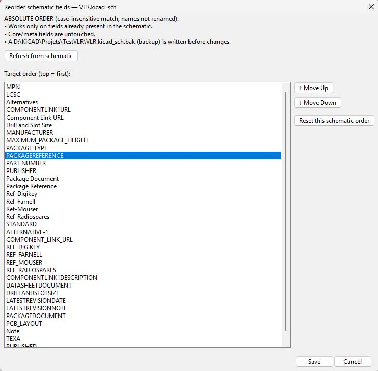

# KiCad Reorder Schematic Fields Plugin

A safe, GUI-based KiCad Action Plugin to **reorder user `(property ...)` fields** in `.kicad_sch` files so they match an **absolute target order** you define. Core/meta fields (Reference, Value, Footprint, Datasheet, Description, `ki_*`) are never touched.

- ✅ KiCad 6/7/8/9 (Windows 11 tested)
- ✅ Robust S-expression parsing (quotes/escapes, multi-line)
- ✅ Atomic writes + `.bak` backup
- ✅ **JSON persistence** next to your schematic: keeps your preferred order between sessions
- ✅ **Single-selection list** with stable focus: Up/Down buttons and **Alt+↑ / Alt+↓** shortcuts

## Why
Consistent field ordering helps readability, automation, and downstream tooling. KiCad doesn’t enforce user-field ordering, so this plugin does it safely.

## Features
- **Absolute order**: every symbol’s *user* fields are reordered to match your GUI list (top to bottom).
- **Non-destructive**: core/meta fields are never moved or modified.
- **Per-schematic JSON**: `<schema>.kicad_sch.reorder.json` stores the order for this schematic.
- **Merge on load**: new fields found in the schematic are appended to your saved order (so nothing is lost).
- **Dry-run mode**: preview without writing.

## Installation
1. Copy `V_eeschema_reorder_fields_plugin.py` (and optionally `V_eeschema_reorder_fields_plugin.png`) to:
- Windows: `%APPDATA%\kicad\<6.0|7.0|8.0|9.0>\scripting\plugins\`
2. Restart KiCad.
3. In Eeschema: `Tools → External Plugins → Reorder schematic fields…`

> **Important:** Close the schematic before applying changes (KiCad caches open files).

## Usage
1. **Browse…** and pick a `.kicad_sch`. Curent path and .kicad_sch is selected by default.
2. Reorder the list via **↑/↓** or **Alt+↑/Alt+↓**.
3. Optional: toggle **Dry-run** to preview.
4. **Apply** → a `.bak` is created, fields are reordered per symbol.
5. Order is saved to JSON so next time you don’t have to redo the list.

## Persistence (JSON)
- **Per schematic**: `<schema>.kicad_sch.reorder.json` (preferred).
- **Load precedence**: per-schematic detected order from the file.
- **Reset buttons**:
- **Reset this schematic Order**: delete the saved default per-schematic order JSON only.

## Safety
- Writes are atomic; original file is rotated to `*.bak`.
- Only user fields are touched; core/meta fields are ignored.

## Limitations
- The GUI operates on a **single-selection** list for maximum stability on Windows.
- This plugin reorders existing fields; it does not create/rename/delete fields.

## Development
- Code is a single Python ActionPlugin for KiCad (wxPython UI). No external deps.
- See inline comments for architecture and parsing details.

 ## Custom change
If you do not want the plugin icon in the toolbar change  
try: self.show_toolbar_button = True  
to  
try: self.show_toolbar_button = False  
around line 579

## Screenshot

## License
MIT — see [LICENSE](LICENSE).
